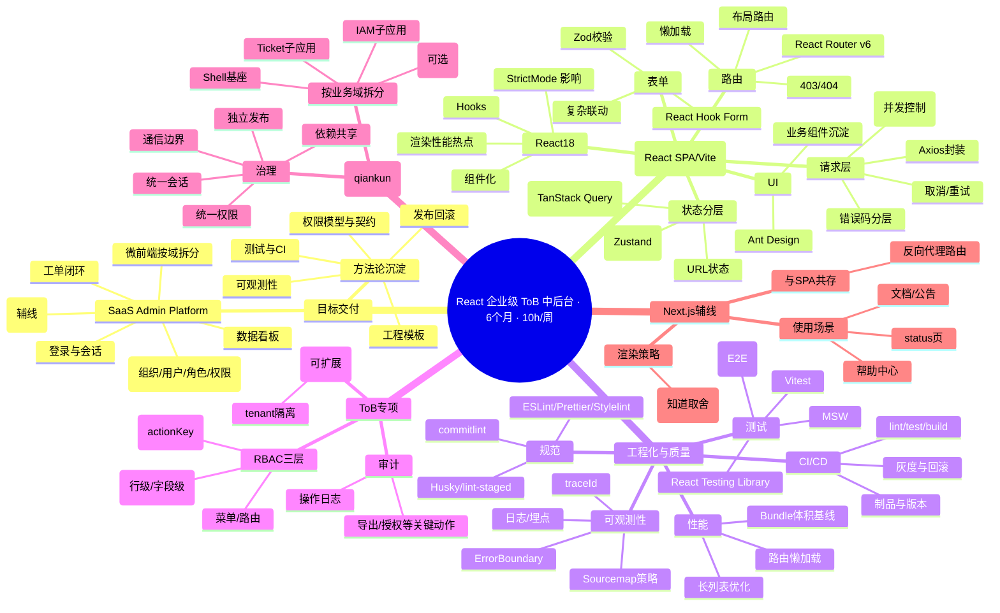
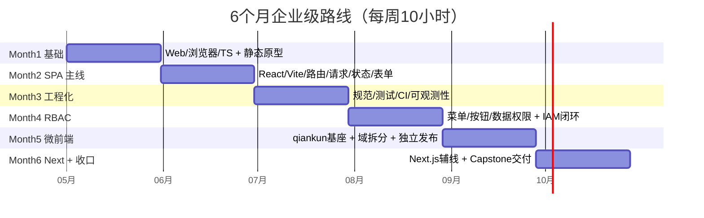

# 91 思维导图（Mermaid）：6 个月企业级 React 中后台全景

> 你可以把本文件直接复制到支持 Mermaid 的平台（GitHub/部分 Markdown 预览）查看。

---

## 91.1 学习路线 Mindmap



---

## 91.2 6 个月时间轴（里程碑）



---

## 91.3 微前端域图（推荐的高层结构）

```mermaid
flowchart TB
  subgraph Shell[Shell 基座]
    Nav[导航/菜单]
    Auth[会话/鉴权/Token刷新]
    Perm[权限初始化与守卫]
    Obs[错误监控/埋点/traceId]
    Shared[共享包 packages/*]
  end

  subgraph IAM[IAM 子应用]
    U[用户]
    R[角色]
    M[菜单/资源]
  end

  subgraph Ticket[Ticket 子应用]
    L[工单列表]
    D[工单详情]
    F[流转与处理记录]
  end

  subgraph Dash[Dashboard 子应用(可选)]
    K[指标卡]
    C[趋势图]
    Drill[明细钻取]
  end

  Shell --> IAM
  Shell --> Ticket
  Shell --> Dash

  Auth --> IAM
  Auth --> Ticket
  Perm --> IAM
  Perm --> Ticket
```
